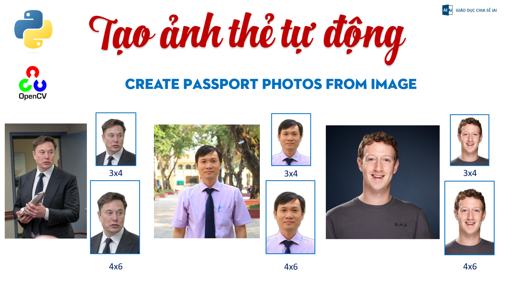

## Make passport ID photos
1. Rotation imamge
2. Remove the background
3. Finds a face - crops the photo to 3x4 and 4x6 cm
## How to run
    inpic folder: input images
    rmbg folder: removed background saved auto
    outpic folder: 3x4 and 4x6 output photos

## link face landmarks
    https://github.com/italojs/facial-landmarks-recognition/blob/master/shape_predictor_68_face_landmarks.dat
## video demo
    https://youtu.be/DfxD_oLBPJQ
